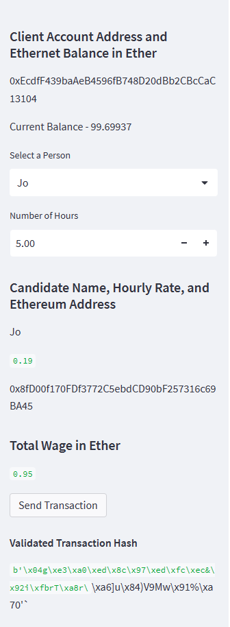
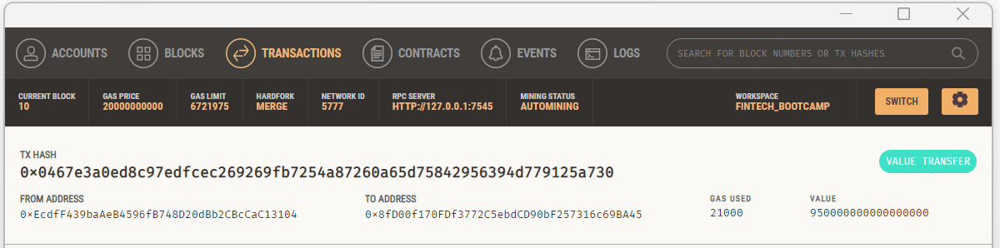

## Background
We work at a startup that is building a new and disruptive platform called Fintech Finder. Fintech Finder is an application that its customers can use to find fintech professionals from among a list of candidates, hire them, and pay them. As Fintech Finder’s lead developer, you have been tasked with integrating the Ethereum blockchain network into the application in order to enable your customers to instantly pay the fintech professionals whom they hire with cryptocurrency.

The complete needs code that enables customers to send cryptocurrency payments to fintech professionals.

## What You're Creating
Two Python files have been created, both of which are contained in the starter folder.

>The first file is called fintech_finder.py. It contains the code associated with the web interface of the application. The code included in this file is compatible with the Streamlit library. 

>The second file is called crypto_wallet.py. This file contains the Ethereum transaction functions that uses import statements, to integrate the crypto_wallet.py Python script into the Fintech Finder interface program that is found in the fintech_finder.py file.

>Integrating these two files will allows automates generating a digital wallet, accessing Ethereum account balances, and signing and sending transactions via a personal Ethereum blockchain called Ganache.

Specifically, Accomplishing The Following:
+ Generate a new Ethereum account instance by using the mnemonic seed phrase provided by Ganache.
+ Fetch and display the account balance associated with your Ethereum account address.
+ Calculate the total value of an Ethereum transaction, including the gas estimate, that pays a Fintech Finder candidate for their work.
+ Digitally sign a transaction that pays a Fintech Finder candidate, and send this transaction to the Ganache blockchain.
+ Review the transaction hash code associated with the validated blockchain transaction.

## Installation Guide

1. Install the required Python libraries:

    ```
    pip install streamlit 
    pip install web3
    pip install hashlib
    pip install dataclasses
    pip install typing
    ```
Intall Ganache

## Usage

To use the PyChain ledger, follow the steps below:

1. In the terminal (bitbash, or other), navigate to the project folder `Challenge_19/StarterCode`
2. In the terminal, run the Streamlit application by using `streamlit run fintech_finder.py`.
3. Select and individual to hire and the amount of required hours.
4. Hit the send transaction dutton to complete the transaction and hire the indivisual.

5. You should see this pull through to your Ganache transactions history.
